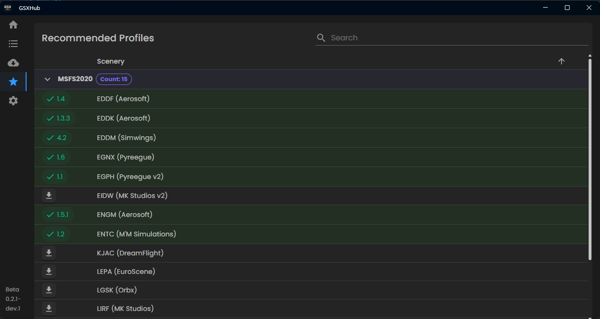
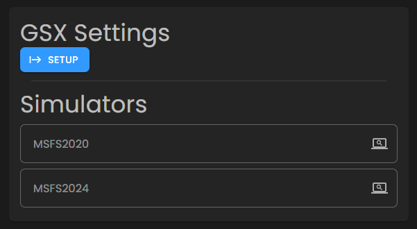
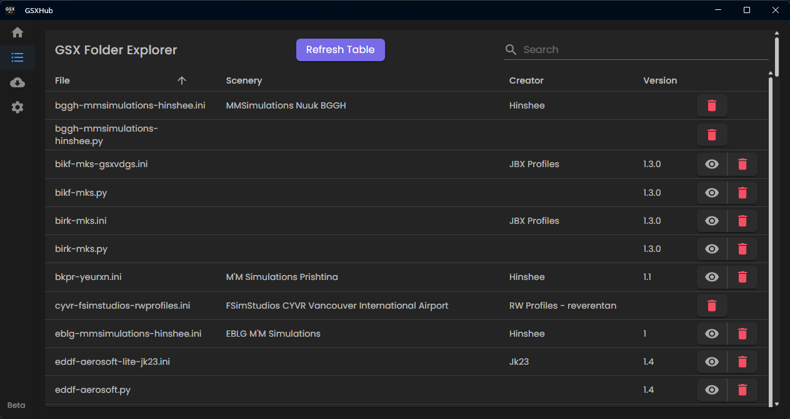
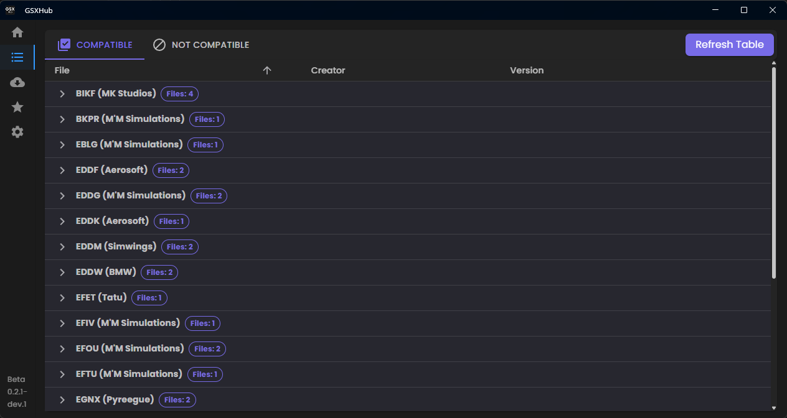

# Version 0.2.1-dev1

Introducing Recommended Profiles...

<!-- more -->
---
## Changelog
### Features
* Added: Recommended Profiles (MSFS2020 & 2024 Support)
* Added: Compatible / Not Compatible Tabs (Explorer Page)
* Added: GH Sponsors
* Added: Docs Link

!!! warning
    ⚠️ These features are experimental and could cause issues. By choosing this branch / version you are accepting that the program may not run flawlessly. Any issues found should be reported via the `GSX Community` Discord.
---

## Recommended Profiles (MSFS2020 / 2024)
<figure markdown="span">
  
  <figcaption>New Settings Section</figcaption>
</figure>

Simply click the search icon in each simulator to find your community folder

Easy, right?

### Backend

There is a new entry:
``` json hl_lines="12-14" title="availprofiles.json"
{
        "Folder": "ENGM (Aerosoft)",
        "ProfileICAO": "ENGM",
        "Scenery": "Aerosoft",
        "Creator": "JBX Profiles",
        "Version": "1.5.1",
        "FileNames": [
            "engm-aerosoft.py",
            "engm-aerosoft-asvdgs.ini",
            "engm-aerosoft-gsxvdgs.ini"
        ],
        "AddonFolders": [
            "aerosoft-airport-engm-oslo"
        ]
    },
```

Here, we're specifying the folder name of the addon that the profile corresponds to.
There's no distinction between 2020 and 2024, if the folder names are different between simulators, it is simply added to the list. 
The app will deal with it when it searches through the specified community folder.

!!! note
    For the time being, the list of `recommended` is based off the file `availprofiles.json` on the [BETA branch](https://github.com/GSX-Hub/Profiles/blob/beta/AvailProfiles.json) of GSX-Hub/Profiles. Whilst this feature is in BETA this is the configuration it wil refer to.

    If you want to add extra folder names, then feel free to DM.

---

## Compatible / Not Compatible Tabs

<figure markdown="span">
  
  <figcaption>Old Format</figcaption>
</figure>

👎No easy distinction between compatible and incompatible profiles.

<figure markdown="span">
  
  <figcaption>New</figcaption>
</figure>

👍Separate Tabs for compatible and incompatible profiles.

---

## GitHub Sponsors
GSX Hub will **always** be free for everyone - that's my guarantee to you. But sadly, the infrastructure that the backend runs on isn't free.
This section is simply an area of recognition to those who are generous enough to help cover the cost of said infrastructure.

At the moment, I've priced a supporter package at $2 a month. 

- 10 Supporters paying $2 would cover the expenses.

If there is enough support, I can reduce this to $1 a month. There is also the option to offer one-time support if you prefer.

📣 Any support via GitHub will automatically earn you a shoutout on the GSX-Hub App.

!!! info
    Sponsoring the app is for the infrastructure **ONLY**. 
    
    Please consider supporting the creators via their own links (available in the next beta build).
    After all, they are the ones who carry GSX Hub.

<figure markdown="span">
[❤️ Sponsor](https://github.com/sponsors/Hinshee){ .md-button .md-button--primary }
</figure>

---

That's all for now folks...

If you have any suggestions, comments or concerns, please post them via the [GSX Community Discord](https://discord.com/invite/Z2gvKemdTh)
