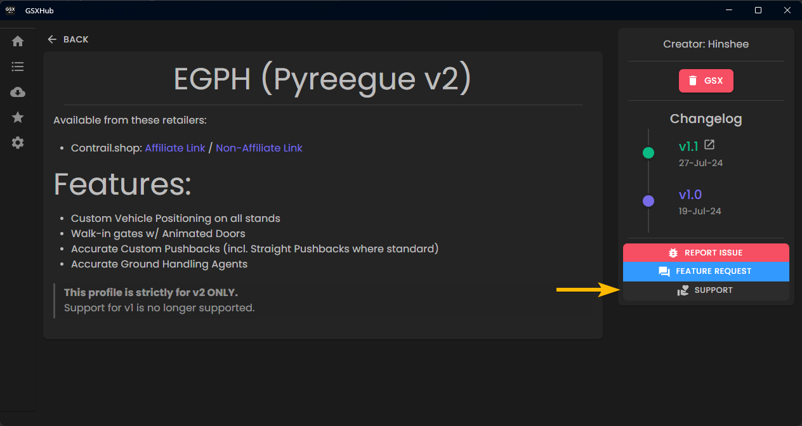
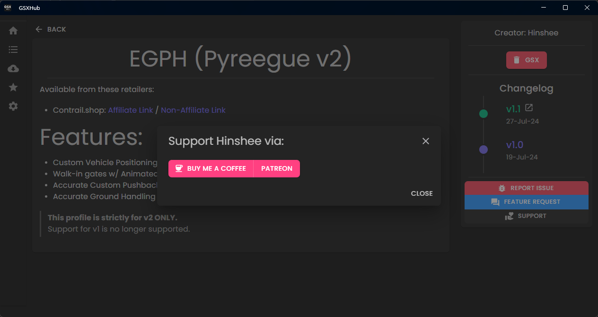

# Creator Supporter Links - 0.2.1-dev2

Somewhat 'hot' on the heals of dev1, dev2 brings about implementing support links for our creators. 

I'm sure that if you were to ask a profile creator "how easy it is to make profiles?" I can hazard a guess that the answer would be something along the lines of "the larger the airport, the longer it takes" - and I couldn't agree more.
<!-- more -->

A decent size international airport with 100+ stands can take upwards of 2-3 days. Consider that we have to change the placement of all vehicles on every stand by hand - it can quickly run the clock up. But I digress... 

The vast majority profile creators' work is available entirely for free through sites like flightsim.to and the iniBuilds manager - others price their work at 25EUR 🤷 

However, if you would like to show your appreciation for the time and effort a creator puts into their profiles, you should have the option to do so. And that's exactly what this update brings to the table.

<figure markdown="span">
  
  <figcaption>Figure 1: The new 'Support' button can be found on a profile's page</figcaption>
</figure>

---

<figure markdown="span">
  
  <figcaption>Figure 2: A creator will have defined through which sites you can support them, this dialog will allow you to follow said links</figcaption>
</figure>

Et voilà!

---

That's all for now!

If you have any suggestions, comments or concerns, please post them via the [GSX Community Discord](https://discord.com/invite/Z2gvKemdTh)