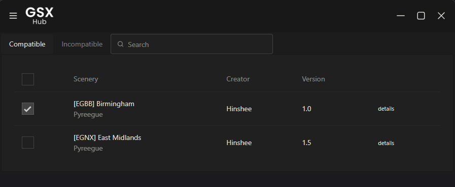
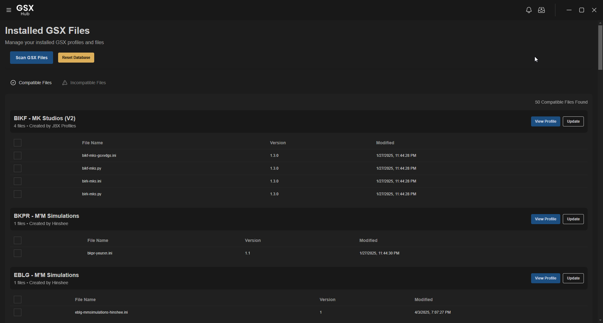

# The Big Refactor

So with the application gaining more traction and direction, I've been seriously considering the long-term viability of the current codebase. Currently, the app runs on .NET MAUI which is windows' cross-platform base for desktop applications. It's been pretty plain sailing since the outset, but recently I've craved some basic features that have taken me days to debug and have working - this doesn't bode well for future development...

<!-- more -->

For example, small asthetic properties such as the titlebar are seemingly impossible to remove without causing a white border to appear - trust me I've scowered StackOverflow and berated ChatGPT for solutions. Whilst it's certainly no deal breaker, I was disheartened by the difficulty of making such an easy change.

Out of genuine curiosity, I started to explore alternative codebases. I had heard of Electron before putting the metaphorical shovel in the ground, but was put off at the prospect of JavaScript - it's by no means a language I'm familiar with so would likely cause more harm than good. But upon playing around with example projects and seeing just how easy it was to manipulate the application's window was a breath of fresh air. It wasn't just about the app window changes, but also seeing taskbar interactions which will be used for background profile updates started to convince me to give it a shot.

And well... after a few days of getting to know Electron and Vue, I started to see some results:

<figure markdown="span">
  
</figure>

And after a few more days...

<figure markdown="span">
  
</figure>

---

## Moving Forward
### What Happens Now?
It's simple. I'm bringing everything that I've coded thus far in .NET MAUI across to Electron-Vue.
That also includes the planned features:

- [ ] Background Updates (Taskbar Interactions etc.)
- [ ] Download Multiple Profiles at once

So, the next big update is an entirely new codebase but all the same features and more.

---

That's all for now!

If you have any suggestions, comments or concerns, please post them via the [GSX Community Discord](https://discord.com/invite/Z2gvKemdTh)