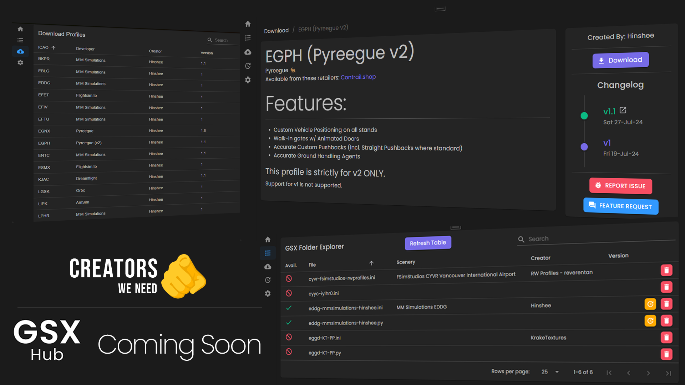

# The Beginning - Version 0.1.0

👋 Hello World!

I write this looking back at where the app first started out, and I'm so pleased with how far it has progressed in just over two months.
<!-- more -->
---

Cast your mind back, if I may, to December 2024...

!!! quote "05/12/2024"
    New kid on the block here to share an upcoming project with you.

    If you're like me, there are times when you think you are all set up for a flight only to realise when you load in that you have forgotten a GSX profile. 
    Or even worse you have to scramble onto flightsim.to, find the right profile, download it, unzip, move and reload Couatl all whilst taxiing...

    Well, I think it's about time we start to make installing and managing profiles significantly easier, don't you?

👀 What a promising looking preview, huh?

I'm not going to lie, I thought this project might flop when I showed some previews, but I was seriously humbled by the initial reception.

The reception gave me a drive to get the ball rolling and to see where it might take the development. Whilst I'm not a gifted coder or developer, I wasn't going
to let it stop me from at least giving it a go - I'd got somewhere in the previews, why not push further?

And so begins the development cycle, albeit a little slow with University work taking priority, but the app was officially off and running.

But where to next?